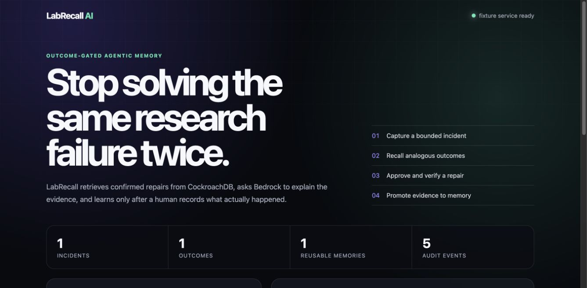

# LabRecall AI

**A research-pipeline repair agent that remembers what actually worked.**



LabRecall turns failed computational-research runs into durable, governed memory.
For each incident it stores structured state and an embedding in CockroachDB, retrieves
semantically similar failures through CockroachDB's distributed vector index, proposes
a bounded repair plan, and learns from the human-confirmed outcome. The public service
is designed for AWS Lambda and Amazon Bedrock.

This is a new project for the 2026 CockroachDB × AWS Build with Agentic Memory
Hackathon. It was started during the official submission period. No ReproFrame source
code was copied into this repository; the separate earlier project is disclosed only
as product-domain context in [`docs/PREEXISTING_WORK.md`](docs/PREEXISTING_WORK.md).

## Why memory is the product

Ordinary troubleshooting chat forgets the environment, repeats rejected advice, and
cannot measure whether a proposed repair worked. LabRecall maintains four linked forms
of memory:

1. episodic memory — exact incident, environment, observations, and attempted actions;
2. semantic memory — vectorized failure signatures and reusable repair lessons;
3. outcome memory — human-confirmed success, failure, side effects, and confidence;
4. governance memory — every retrieval, recommendation, approval, and model/tool call.

CockroachDB is both the transactional source of truth and the vector store. A repair is
never learned unless its outcome is recorded atomically.

Repeated, semantically equivalent successes consolidate into one repair memory instead
of inflating the store. Confirmed failed reuse lowers that memory's calibrated
confidence. Transaction retries use exponential backoff with jitter, while ambiguous
commits are surfaced for operation-ID inspection instead of being blindly replayed.

## Sponsor technology plan

- **CockroachDB Distributed Vector Indexing:** runtime similarity search over failure
  signatures while keeping transactional state and embeddings consistent.
- **CockroachDB Cloud Managed MCP Server:** a separately scoped auditor agent inspects
  live schema, memory quality, and safe aggregate statistics with auditable access.
- **CockroachDB Agent Skills:** the official schema and statement-analysis skills drive
  reproducible database reviews; their outputs will be checked into an evidence ledger.
- **AWS Lambda:** hosts the public event-driven API.
- **Amazon Bedrock:** Titan creates embeddings and Nova generates evidence-bounded repair
  explanations; fixture mode remains fully offline for tests.

## Local foundation

```bash
uv venv --python 3.12
uv pip install --python .venv/bin/python -e '.[dev]'
.venv/bin/pytest -q
PYTHONPATH=src .venv/bin/python -m labrecall.benchmark
.venv/bin/uvicorn labrecall.app:app --reload
```

The default `LABRECALL_MODE=fixture` uses deterministic embeddings and an in-memory
repository. Set `LABRECALL_MODE=cloud`, `DATABASE_URL`, and AWS settings only in a local
`.env` or deployment secret store. Never commit credentials.

The Lambda template reads the database URL from AWS Secrets Manager at cold start;
CloudFormation receives only the secret ARN. Its IAM policy allows only the two declared
Bedrock models and that one secret.

For a credentialed CockroachDB smoke test without persisting the connection string:

```bash
DATABASE_URL='postgresql://…' PYTHONPATH=src \
  .venv/bin/python scripts/live_cockroach_proof.py
```

## Safety boundary

LabRecall proposes bounded diagnostic steps; it does not execute shell commands or
modify infrastructure. Human approval and an observed outcome are required before a
repair becomes reusable memory. The demo uses synthetic incidents and no personal or
proprietary research data.

Official-rule verification and build gates are recorded in
[`docs/OFFICIAL_RULES.md`](docs/OFFICIAL_RULES.md) and
[`docs/PROJECT_PLAN.md`](docs/PROJECT_PLAN.md). Open-source attribution and the live
database proof are recorded in [`docs/OPEN_SOURCE_REUSE.md`](docs/OPEN_SOURCE_REUSE.md)
and [`docs/CLOUD_EVIDENCE.md`](docs/CLOUD_EVIDENCE.md).
The pinned official Agent Skills review is in
[`docs/SKILL_EVIDENCE.md`](docs/SKILL_EVIDENCE.md).
The deployable system boundary and trust model are in
[`docs/ARCHITECTURE.md`](docs/ARCHITECTURE.md).

## Read-only Managed MCP auditor

Trusted Codex clients can load the project-scoped `.codex/config.toml` and authenticate
with CockroachDB Cloud OAuth. The committed allowlist exposes only read-oriented schema,
query, and plan-inspection tools; database-creation and insert tools are not enabled.

```bash
codex mcp login --scopes mcp:read cockroachdb-cloud
codex mcp get cockroachdb-cloud
```

OAuth tokens stay in the local Codex credential store and are never committed. A new
trusted Codex session is required after changing MCP configuration; the current client
cannot hot-load a newly added server.
