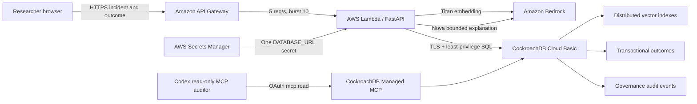

# Architecture and trust boundaries

## Core transaction

1. The API validates bounded incident fields and creates an immutable incident ID.
2. Bedrock Titan produces a normalized 1024-dimensional embedding.
3. CockroachDB retrieves namespace-scoped repair memories through cosine distance.
4. Bedrock Nova explains only the supplied memories and fixed validation actions. It
   cannot add actions or execute infrastructure changes.
5. The researcher chooses what to try and records an observed outcome.
6. The outcome, memory promotion or confidence update, and audit evidence commit in one
   CockroachDB transaction.

## Failure behavior

- Serialization failures replay the complete short transaction with exponential backoff
  and jitter.
- Unknown commit outcomes are not blindly replayed unless the operation is explicitly
  idempotent.
- A Bedrock explanation failure falls back to deterministic, human-reviewable language
  and marks `generation_degraded=true`.
- API errors return a request ID without exposing database or cloud exception text.
- Lambda concurrency is capped at two; API Gateway throttles excess traffic.

## Data and access boundaries

- The public demo accepts synthetic inputs only and never executes proposed commands.
- `labrecall_app` has only `SELECT`, `INSERT`, and `UPDATE` on application tables.
- The development cluster has no `0.0.0.0/0` allowlist entry.
- The committed MCP configuration exposes only read-oriented tools and authenticates with
  OAuth scope `mcp:read`; write tools are absent from the allowlist.
- The Lambda receives only a Secrets Manager ARN from CloudFormation. Its execution role
  can invoke two named Bedrock models and read one named secret.
