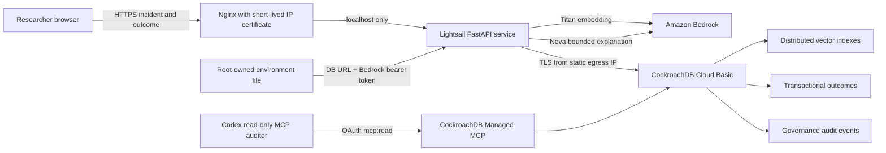

# Architecture and trust boundaries

## Core transaction

1. The API validates bounded incident fields and creates an immutable incident ID.
2. Bedrock Titan produces a normalized 1024-dimensional embedding.
3. CockroachDB retrieves namespace-scoped repair memories through cosine distance.
4. Bedrock Nova explains only the supplied memories and fixed validation actions. It
   cannot add actions or execute infrastructure changes.
5. The researcher chooses what to try and records an observed outcome.
6. The outcome, memory promotion or confidence update, and audit evidence commit in one
   CockroachDB transaction.

## Failure behavior

- Serialization failures replay the complete short transaction with exponential backoff
  and jitter.
- Unknown commit outcomes are not blindly replayed unless the operation is explicitly
  idempotent.
- A Bedrock explanation failure falls back to deterministic, human-reviewable language
  and marks `generation_degraded=true`.
- API errors return a request ID without exposing database or cloud exception text.
- Nginx limits the public API to five requests/second with a burst of ten. The service
  uses one worker on the bounded Lightsail instance.
- Let's Encrypt authenticates the static IPv4 directly with a six-day certificate;
  Certbot checks renewal twice daily and reloads Nginx only after successful renewal.

## Data and access boundaries

- The public demo accepts synthetic inputs only and never executes proposed commands.
- `labrecall_app` has only `SELECT`, `INSERT`, and `UPDATE` on application tables.
- The development cluster has no `0.0.0.0/0` allowlist entry; only the Lightsail static
  IPv4 address and an explicitly approved development address are allowed.
- The committed MCP configuration exposes only read-oriented tools and authenticates with
  OAuth scope `mcp:read`; write tools are absent from the allowlist.
- Browser sessions are mapped to hashed CockroachDB namespaces, preventing one judge's
  synthetic proof from affecting another judge's cold start.
- Lightsail does not support service roles. For this time-bounded exploration demo, the
  Bedrock-specific API key and database URL live in one root-owned `0640` environment
  file and are removed after judging. The browser never receives either secret.
